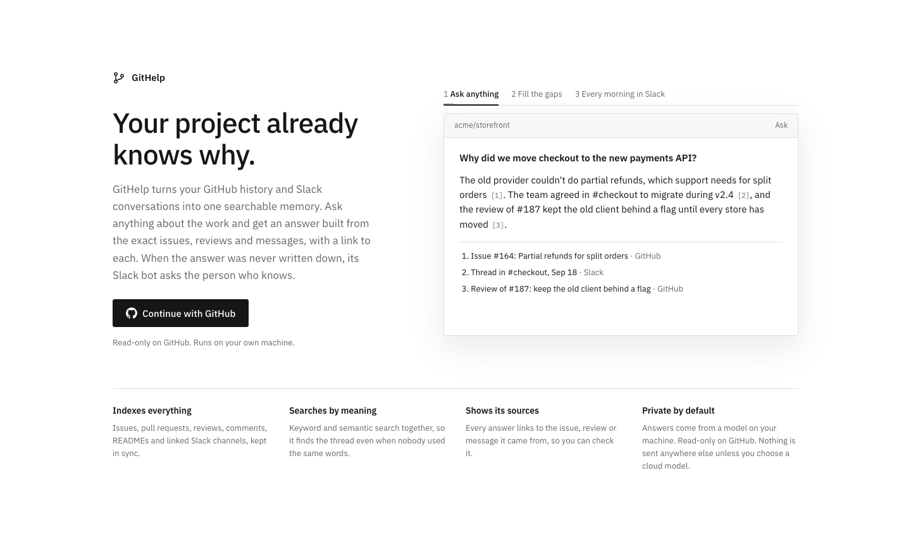

# GitHelp

**Your project already knows why.** GitHelp turns a repository's GitHub history and its Slack conversations into one
searchable memory. Ask anything about the work, such as why a decision was made, what is blocking a release or why an
issue is late, and get an answer built from the exact issues, reviews and messages, with a link to each.

When the answer was never written down, GitHelp asks. Its Slack bot messages the owner of an issue that has passed its
milestone's due date, asks what's holding it up and when they expect to finish, and adds the reply to the memory. A
daily or weekly digest posts what's late, and why, to the team's channel.



Under the hood it is retrieval-augmented generation: issues, pull requests, reviews, comments, READMEs and linked Slack
channels are indexed with both keyword and semantic search, the best matches are given to a language model, and the
answer cites them. GitHelp is read-only on GitHub and runs on your own machine; by default the model runs locally
through Ollama, so nothing leaves your computer.

## Contents

- [What you need](#what-you-need)
- [Set up](#set-up) (about 15 minutes)
- [First run](#first-run)
- [Running it all the time, for your team](#running-it-all-the-time-for-your-team)
- [Using a cloud model instead of Ollama](#using-a-cloud-model-instead-of-ollama)
- [Troubleshooting](#troubleshooting)
- [Security and your data](#security-and-your-data)
- [Development](#development)

## What you need

- **Node.js 22.13 or newer.** Check with `node -v`.
- **A GitHub account** with access to the repositories you want to track.
- **A Slack workspace where you can install an app.** Some workspaces need an admin to approve new apps.
- **[Ollama](https://ollama.com)** to run the models locally (free), or an Anthropic or OpenAI-compatible API key.
  About 4 GB of disk for the default models.

## Set up

### 1. Clone and install

```bash
git clone https://github.com/Sanjay18bala/Git-Help.git
cd Git-Help
npm install
```

### 2. Create a GitHub OAuth App

This lets you sign in with GitHub. Each person running GitHelp creates their own; it's free.

1. Open <https://github.com/settings/applications/new>.
2. Fill in the form exactly like this, then click **Register application**:

   | Field | Value |
   |---|---|
   | Application name | `GitHelp` (or anything you like) |
   | Homepage URL | `http://localhost:5173` |
   | Authorization callback URL | `http://localhost:5173/auth/callback` |

3. Copy the **Client ID**.
4. Click **Generate a new client secret** and copy it. GitHub shows it only once.

### 3. Create the Slack app

The app does two jobs: it reads the channels you link to a repository, and its bot messages owners about late work
and receives their replies.

1. Open <https://api.slack.com/apps> and click **Create New App** → **From a manifest**. Pick your workspace.
2. Choose **JSON**, replace everything with this manifest, and click **Next** → **Create**:

   ```json
   {
     "display_information": {
       "name": "GitHelp",
       "description": "Asks owners why late GitHub work is late, and reads channels linked to your repositories."
     },
     "features": {
       "bot_user": { "display_name": "GitHelp", "always_online": true },
       "app_home": { "home_tab_enabled": false, "messages_tab_enabled": true, "messages_tab_read_only_enabled": false }
     },
     "oauth_config": {
       "scopes": {
         "user": ["channels:read", "channels:history", "groups:read", "groups:history", "users:read"],
         "bot": ["chat:write", "im:write", "im:history", "users:read", "users:read.email", "channels:read", "groups:read"]
       }
     },
     "settings": {
       "event_subscriptions": { "bot_events": ["message.im"] },
       "org_deploy_enabled": false,
       "socket_mode_enabled": true,
       "token_rotation_enabled": false
     }
   }
   ```

3. Go to **Install App** (left menu) → **Install to Workspace** → **Allow**.
4. On **OAuth & Permissions**, copy two tokens:
   - **User OAuth Token**, starting with `xoxp-`
   - **Bot User OAuth Token**, starting with `xoxb-`
5. On **Basic Information**, scroll to **App-Level Tokens** → **Generate Token and Scopes**. Name it `socket`, add the
   `connections:write` scope, click **Generate**, and copy the token starting with `xapp-`. Leave token rotation off.

### 4. Download the models

Install [Ollama](https://ollama.com) and start it. Then download a chat model and an embedding model:

```bash
ollama pull gemma3:4b
ollama pull nomic-embed-text
```

`gemma3:4b` needs about 3 GB of memory. With more, a larger model such as `qwen3:8b` gives better answers; you can
switch models later in **Settings**.

### 5. Fill in `.env`

```bash
cp .env.example .env        # macOS and Linux
copy .env.example .env      # Windows
```

Open `.env` and fill in every value:

```ini
GITHUB_CLIENT_ID=...        # step 2
GITHUB_CLIENT_SECRET=...    # step 2
SESSION_SECRET=...          # see below
SLACK_USER_TOKEN=xoxp-...   # step 3
SLACK_BOT_TOKEN=xoxb-...    # step 3
SLACK_APP_TOKEN=xapp-...    # step 3
```

Put each value straight after the `=`, with no spaces or comments after it.

`SESSION_SECRET` is any long random string; it encrypts your login and the keys GitHelp stores. Generate one with:

```bash
node -e "console.log(require('crypto').randomBytes(32).toString('hex'))"
```

`.env` is in `.gitignore`. Never commit it.

### 6. Run

```bash
npm run dev
```

Open <http://localhost:5173> and click **Continue with GitHub**. If something in `.env` is missing, `npm run dev`
stops and names it.

## First run

Sign in and open a repository. Deadlines come from GitHub milestones, so give a milestone a due date to see what's late.
To have the bot ask people why, link a Slack channel to the repository and turn on overdue alerts in **Settings**.

Everything else is in **Help** in the app's sidebar, which you can search.

## Running it all the time, for your team

GitHelp only checks deadlines, messages people and posts digests while it's running. To keep it on, run it on a
machine that's always on, such as a small cloud server or a computer at the office, with Docker:

1. On that machine, clone the repository and create `.env` as in [Set up](#set-up), then add:

   ```ini
   APP_URL=https://githelp.example.com
   ALLOWED_GITHUB_USERS=your-login,a-teammate
   ```

   `APP_URL` is the address people open. `ALLOWED_GITHUB_USERS` lists the GitHub logins allowed to sign in; GitHelp
   refuses to start without it when `APP_URL` isn't localhost, because anyone signed in can read the linked Slack
   channels.
2. In your GitHub OAuth App (or a second one for the server), set the **Homepage URL** to `APP_URL` and the
   **Authorization callback URL** to `APP_URL/auth/callback`.
3. Build and start it:

   ```bash
   docker build -t githelp .
   docker run -d --name githelp --restart unless-stopped -p 5173:5173 --env-file .env -v githelp-data:/app/.data githelp
   ```

4. If people reach it over the internet, put it behind HTTPS (for example with [Caddy](https://caddyserver.com) as a
   reverse proxy) and use an `https://` `APP_URL`.

Good to know:

- **Slack needs no public address.** The bot receives replies over Socket Mode, an outgoing connection.
- **Models:** inside Docker, `localhost` is the container. To use Ollama on the same machine, add
  `OLLAMA_URL=http://host.docker.internal:11434` to `.env`, or choose a cloud model in **Settings**.
- **Data** lives in the `githelp-data` volume, so it survives restarts and upgrades. To upgrade: `git pull`, build
  again, then `docker rm -f githelp` and run the same `docker run` command.
- **Without Docker:** `npm run build`, then `npm start` (Node 22.13+), kept running with your process manager of choice.
- **One GitHelp per team.** Everyone who signs in shares the same Slack links, bot and settings, and the background
  checks use the GitHub access of whoever signed in most recently.

## Using a cloud model instead of Ollama

In **Settings**, set the chat provider to **Anthropic** or **OpenAI-compatible** (OpenAI, Groq, OpenRouter, Together,
LM Studio, vLLM), enter the API key and click **Save and test**. Anthropic has no embedding models, so search keeps
using Ollama or an OpenAI-compatible embedding model.

Keys are stored encrypted on your machine. With a cloud provider, each question and the GitHub and Slack text that
matches it are sent to that provider.

## Troubleshooting

| What you see | Fix |
|---|---|
| `Missing ... in .env` when starting | Fill in the named values (step 5) and make sure `.env` is in the project folder. |
| `APP_URL is not localhost, so set ALLOWED_GITHUB_USERS` | Add the GitHub logins allowed to sign in, comma-separated (see [Running it all the time](#running-it-all-the-time-for-your-team)). |
| Sign-in says your account isn't on the list | Add your GitHub login to `ALLOWED_GITHUB_USERS` and restart. |
| GitHub: **"The redirect_uri is not associated with this application"** | The callback URL in your OAuth App must be exactly `http://localhost:5173/auth/callback`. |
| `Port 5173 is in use` | Stop whatever is using it. The port can't change without also changing your OAuth App URLs. |
| `Sign-in failed: state_mismatch` | Start again from <http://localhost:5173> instead of an old GitHub tab. |
| `Sign-in failed: incorrect_client_credentials` | The client ID or secret in `.env` is wrong. Copy them again and restart. |
| Slack: "token is invalid" or "missing a permission" | Check the three Slack tokens in `.env`. If you edited the manifest, reinstall the app (**Install App** → **Reinstall**) and copy the tokens again. |
| A channel is missing from **Link Slack channel** | You can only link channels you're a member of. Join it in Slack first. |
| The bot sends nothing | Check that the repo is switched on in **Settings → Overdue alerts**, the issue has an assignee and a milestone with a past due date, and that person's Slack link is confirmed. |
| Replies to the bot don't show up | `SLACK_APP_TOKEN` is missing or wrong, or **Socket Mode** is off in the Slack app. **Settings → Slack bot** says when replies can't be received. |
| "Can't reach Ollama" | Start Ollama (open the app, or run `ollama serve`), or fix the URL in **Settings**. |
| "model … not found" | Download it with `ollama pull <model>`, or pick an installed model in **Settings**. |
| An organization's repositories are missing | The organization restricts third-party apps. Open <https://github.com/settings/applications>, select your app, and click **Grant** or **Request** for the organization. |
| `API rate limit exceeded` | GitHub allows 5,000 requests per hour. Wait for it to reset. |

## Security and your data

- **Read-only on GitHub.** GitHub has no read-only scope for private repositories, so GitHelp asks for `repo` and
  `read:org`. The local server only forwards `GET` requests, and only to the endpoints the app uses (`ALLOWED` in
  `server.js`), so GitHelp can't change anything in your repositories.
- **Your GitHub token** is kept in an encrypted, `HttpOnly` cookie that the page's JavaScript can't read. So that
  overdue checks can run in the background, an encrypted copy is also stored in `.data/`; signing out deletes it.
- **Slack.** The user token only reads channels you link. The bot only messages people whose link you confirmed, and
  only about late issues in repositories you switched on.
- **Everything stays on your machine.** Linked channels, replies and the search index live in `.data/git-help.db`
  (gitignored). Nothing is sent anywhere except GitHub, Slack and the model provider you chose.
- **Revoke access** at <https://github.com/settings/applications> and from your Slack app's settings.

## Development

```bash
npm run build && npm start   # the production server on http://localhost:5173 (stop npm run dev first)
npx vite build           # check that the frontend compiles
```

| File | What it does |
|---|---|
| `server.js` | Sign-in, the encrypted session cookie, the read-only GitHub proxy, and the API the UI calls |
| `slack.js` | Reading Slack and syncing linked channels |
| `bot.js` | The Slack bot: matching GitHub users to Slack users |
| `alerts.js` | Overdue checks, the bot's messages and digests, and receiving replies over Socket Mode |
| `dates.js` | Reading an expected finish date out of a reply ("Friday", "Oct 9", "in 3 days") |
| `start.js`, `Dockerfile` | The production server and container: the built app, the API and the background checks |
| `rag.js`, `llm.js` | Search and answers: indexing, hybrid keyword and vector search, model providers |
| `db.js`, `secrets.js` | The local SQLite database, and encryption for cookies and stored keys |
| `src/main.jsx`, `src/style.css` | The whole interface |

`CLAUDE.md` describes the architecture and design rules in more detail.

To show new GitHub data: add the endpoint to `ALLOWED` in `server.js`, then fetch it
in the UI. Write actions (commenting, merging) are deliberately out of scope; please open an issue to discuss them
first.

Contributions are welcome: fork, make your change, check it with `npx vite build` and the app itself, and open a pull request explaining what changed and
why.

## License

[MIT](LICENSE)
